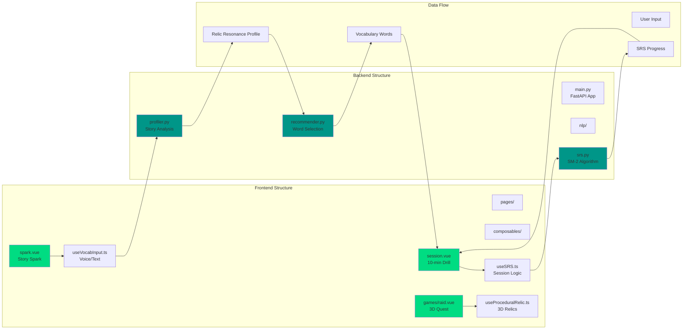
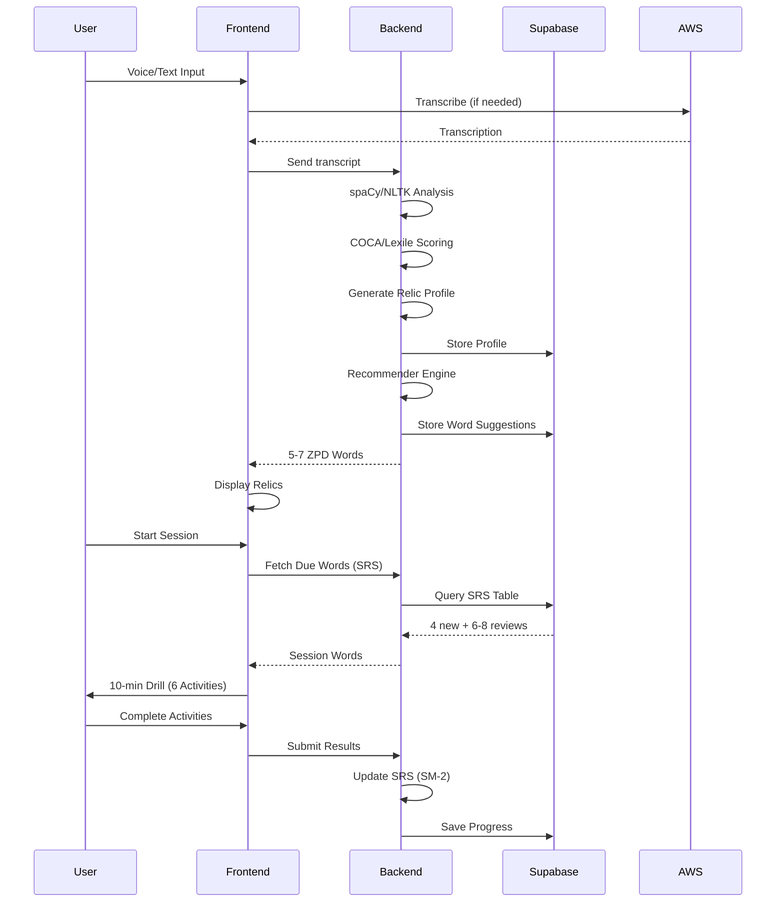
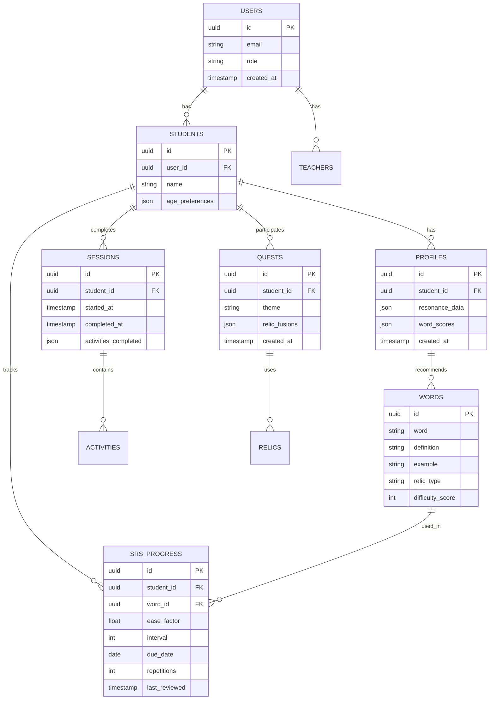
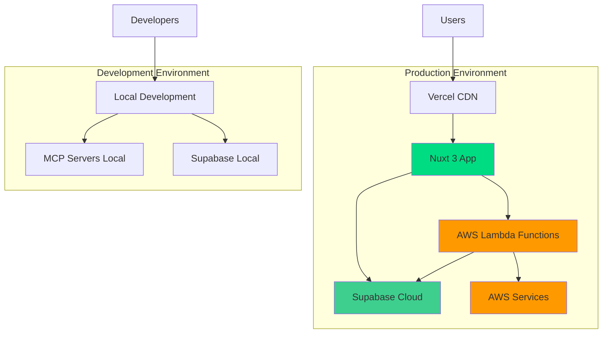

# Palabam Architecture

## Tech Stack Overview

```
┌─────────────────────────────────────────────────────────────────┐
│                         Palabam Monorepo                         │
│                         (PNPM Workspace)                         │
├─────────────────────────────┬───────────────────────────────────┤
│         Frontend            │            Backend                │
│      (Nuxt 3 + Vue)         │         (FastAPI)                 │
└─────────────────────────────┴───────────────────────────────────┘
```

## System Architecture Diagram

```mermaid
graph TB
    subgraph "Client Layer"
        Browser[Web Browser]
        Mobile[Mobile PWA]
    end

    subgraph "Frontend - Vercel"
        Nuxt[Nuxt 3 Application]
        NuxtUI[@nuxt/ui Components]
        TresJS[TresJS 3D Engine]
        Cientos[Cientos Helpers]
        Tailwind[TailwindCSS]
        WebSpeech[Web Speech API]
    end

    subgraph "Backend - AWS Lambda"
        FastAPI[FastAPI Server]
        NLP[spaCy/NLTK NLP]
        SRS[SM-2 SRS Algorithm]
        Recommender[Relic Resonance Engine]
    end

    subgraph "Supabase Cloud"
        Auth[Authentication]
        DB[(PostgreSQL Database)]
        Realtime[Realtime Subscriptions]
        Storage[File Storage]
        EdgeFuncs[Edge Functions]
    end

    subgraph "AWS Services"
        Transcribe[AWS Transcribe]
        Lambda[AWS Lambda]
    end

    subgraph "External Resources"
        PolyPizza[poly.pizza 3D Models]
        COCA[COCA/Lexile Corpora]
    end

    subgraph "Development Tools"
        MCPNuxt[Nuxt UI MCP]
        MCPSupabase[Supabase MCP]
        MCPAWS[AWS MCP]
        Cursor[Cursor IDE]
    end

    Browser --> Nuxt
    Mobile --> Nuxt
    Nuxt --> NuxtUI
    Nuxt --> TresJS
    Nuxt --> Cientos
    Nuxt --> Tailwind
    Nuxt --> WebSpeech
    Nuxt --> Auth
    Nuxt --> Realtime
    Nuxt --> DB
    WebSpeech -.fallback.-> Transcribe
    Nuxt --> FastAPI
    FastAPI --> NLP
    FastAPI --> SRS
    FastAPI --> Recommender
    FastAPI --> Transcribe
    FastAPI --> Lambda
    FastAPI --> DB
    FastAPI --> Auth
    Recommender --> COCA
    TresJS --> PolyPizza
    Cursor --> MCPNuxt
    Cursor --> MCPSupabase
    Cursor --> MCPAWS

    style Nuxt fill:#00DC82
    style FastAPI fill:#009688
    style DB fill:#3ECF8E
    style Auth fill:#3ECF8E
    style Realtime fill:#3ECF8E
    style Transcribe fill:#FF9900
    style Lambda fill:#FF9900
    style TresJS fill:#00DC82
    style Cientos fill:#00DC82
```

## Component Architecture



## Data Flow - Story Spark to Session



## Technology Stack Details

### Frontend Stack
- **Framework**: Nuxt 3 (Vue 3)
- **UI Library**: @nuxt/ui (TailwindCSS-based)
- **3D Engine**: TresJS (Three.js wrapper)
- **3D Helpers**: @tresjs/cientos (OrbitControls, effects)
- **Styling**: TailwindCSS
- **State Management**: Nuxt Composables
- **PWA**: Nuxt PWA module (auto-generated manifest)

### Backend Stack
- **Framework**: FastAPI (Python)
- **NLP**: spaCy, NLTK
- **ML**: scikit-learn
- **SRS Algorithm**: SM-2 (SuperMemo 2)
- **AWS Integration**: boto3 (Transcribe, Lambda)

### Infrastructure
- **Frontend Hosting**: Vercel
- **Backend Hosting**: AWS Lambda (via Supabase Edge Functions or direct)
- **Database**: Supabase (PostgreSQL)
- **Authentication**: Supabase Auth
- **Realtime**: Supabase Realtime
- **File Storage**: Supabase Storage
- **Voice Processing**: Web Speech API (primary), AWS Transcribe (fallback)

### Development Tools
- **Package Manager**: PNPM (monorepo)
- **MCP Servers**: Nuxt UI, Supabase, AWS
- **IDE**: Cursor (with MCP integration)

### External Resources
- **3D Models**: poly.pizza (CC-BY low-poly GLTF)
- **Corpora**: COCA, Lexile (for word difficulty scoring)

## Database Schema Overview



## Deployment Architecture



## Key Architectural Decisions

1. **Monorepo with PNPM**: Single repository for frontend and backend, enabling shared types and easier development.

2. **Nuxt 3 for Frontend**: Server-side rendering, auto-imports, and excellent DX with Vue 3 Composition API.

3. **FastAPI for Backend**: Fast, modern Python framework ideal for NLP workloads and async operations.

4. **Supabase for Infrastructure**: Provides database, auth, realtime, and storage in one platform, reducing operational complexity.

5. **TresJS + Cientos**: Vue-friendly Three.js wrapper with helpful composables for 3D interactions.

6. **SM-2 SRS Algorithm**: Proven spaced repetition algorithm for long-term vocabulary retention.

7. **Dual Voice Input**: Web Speech API for low-latency, AWS Transcribe for accuracy in noisy environments.

8. **MCP Integration**: Enables Cursor IDE to use live documentation and tooling during development.

9. **PWA First**: Mobile-ready without native app development, works on school iPads.

10. **No Grade Labels**: Relic resonance system scales from toddlers to adults using the same engine.

